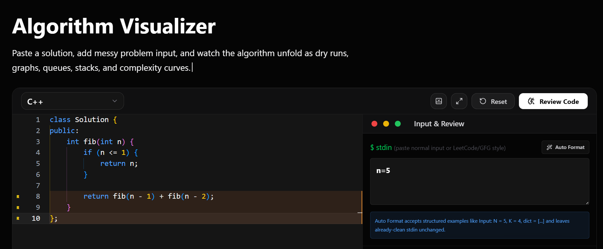
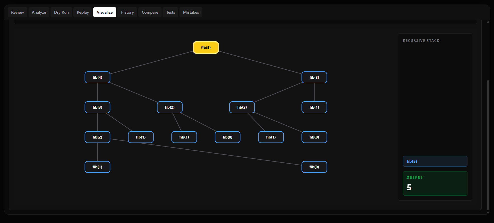
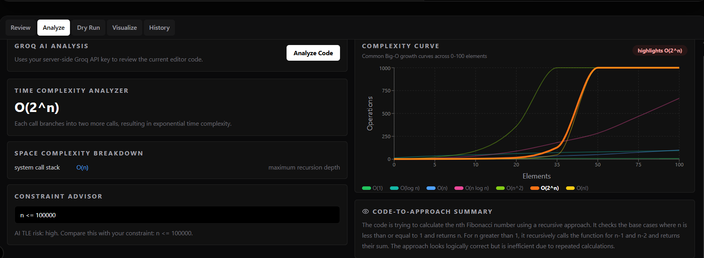
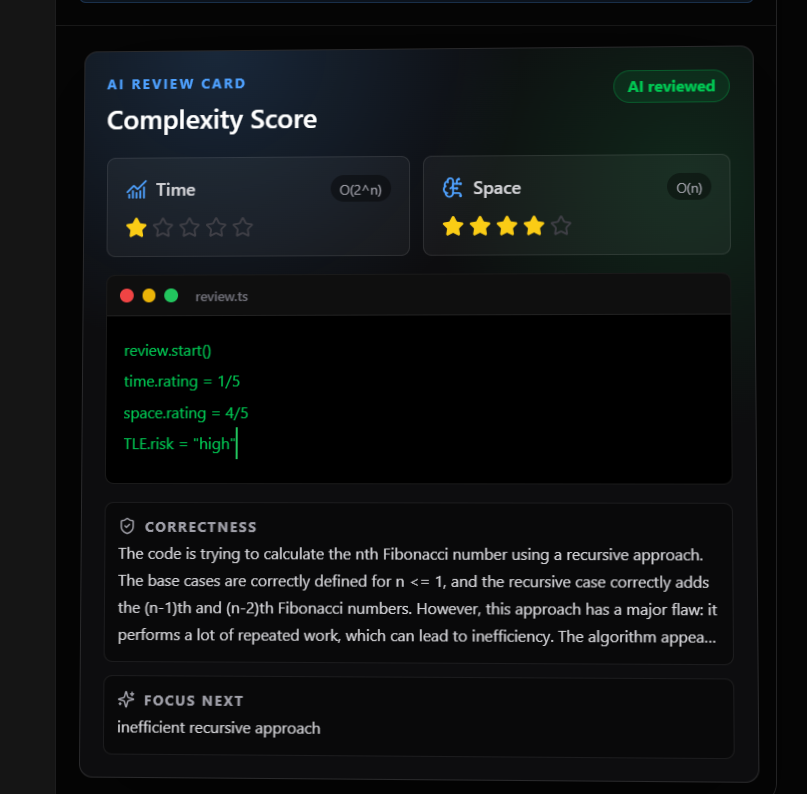

# CodeFlow

CodeFlow is a dark, visual DSA learning playground built for understanding algorithms instead of just writing code. Paste a solution, add input, and generate AI-assisted reviews, dry-run tables, animated data-structure visualizations, and complexity curves.



## Features

- AI review for correctness, complexity, edge cases, and TLE risk
- Dry-run table generation from code and input
- Animated visualizations for arrays, graphs, linked lists, recursion, and topological-sort style flows
- Complexity curve comparison for common Big-O classes
- Auto-formatting for common problem inputs like `nums = [...]`, `head = [...]`, and `dict = [...]`
- Review history backed by local state and optional PostgreSQL storage

## Screenshots

### Visualizer



### Analysis



### Complexity Score



## Tech Stack

- Next.js
- TypeScript
- Tailwind CSS
- Monaco Editor
- Zustand
- Recharts
- Lucide React
- Groq API for AI analysis
- PostgreSQL support for review history

## Getting Started

Install dependencies:

```bash
npm install
```

Create `.env.local` from `.env.example`:

```bash
cp .env.example .env.local
```

Add your Groq key:

```env
GROQ_API_KEY=your_groq_api_key_here
GROQ_MODEL=llama-3.3-70b-versatile
```

Run the development server:

```bash
npm run dev
```

Open:

```txt
http://localhost:3000
```

## Scripts

```bash
npm run dev
npm run build
npm run lint
```

## Environment Variables

| Variable | Required | Description |
| --- | --- | --- |
| `GROQ_API_KEY` | Yes | Used for AI review, dry-run, and visualization trace generation |
| `GROQ_MODEL` | No | Defaults to the model configured in `.env.example` |
| `DATABASE_URL` | No | Optional PostgreSQL connection for persisted review history |

## Notes

CodeFlow does not execute arbitrary user code. It focuses on algorithm review, symbolic dry runs, and data-structure visualization so the experience stays centered on learning and debugging DSA logic.

## Author

Built by **Drxquantam**.
